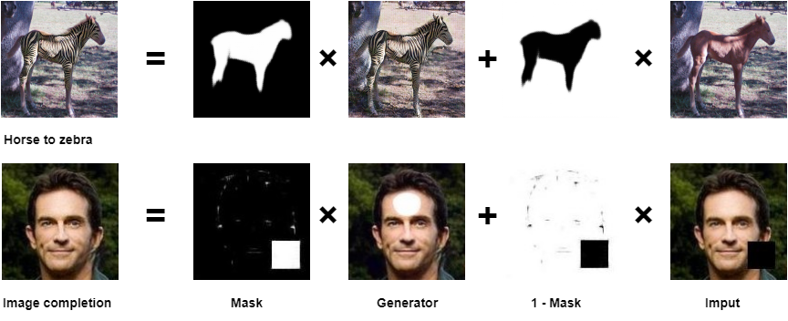

# BPGAN: An Adaptive Background-Preserving  Generative Adversarial Network  for Image-to-Image Translation
Background-Preserving GAN (BPGAN) is proposed to combine the clear background of original image and the translated foreground of generated image to obtain an image with clear background.

